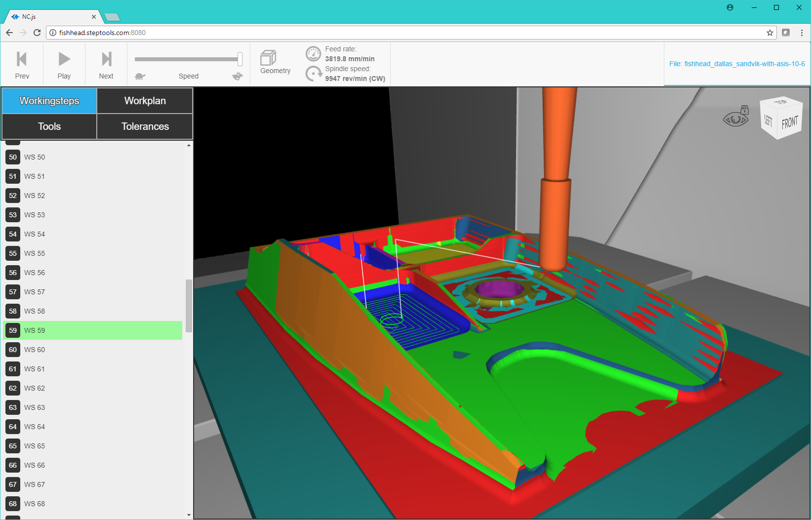

# NC.js

NC.js is the Web interface for the Digital Thread.  This implement a
rich REST API for process and models as well as a matching client that
displays the 3D part models for machining workpiece, tools, CNC, as
well as removal simulation, PMI annotations, MTConnect positional
data, QIF face status, and other aspects of a Digital Twin on the
Digital Thread.

This software Javascript under the Apache license, so that you can
customize the client and REST API as desired.  On the server, the REST
API uses the STEPNode native Node.js wrapper for the STEP Tools
commercial technology stack, which handles STEP and STEP-NC
read/write, analysis, geometry manipulation, and material removal
simulation.

 - [NC.js Documentation](docs/index.md)




## Getting Started

  1. Download NC.js:

  ```
  > git clone https://github.com/steptools/NC.js.git
  > cd NC.js
  ```

  ------------------------------------------------------------------------------
  2. Setting up which model to use
  
  Sample AP238 files are available at http://www.ap238.org/  
  In config.js put the path of the STEP-NC file you want to use in the file object
  under the dir key
 
  ```
  "file" : {"dir": "path_to_.stpnc_file"} 
  ```
  ------------------------------------------------------------------------------
  3. Install node packages

  ```
  > npm install
  ```

  ------------------------------------------------------------------------------
  4. Install Glyphicons (Semi-Optional)
  
  The package contains a placeholder `scss` under the client fonts directory.   If you have access to Glyphicons, you can copy the supporting files into this directory.   If you skip this step, the application will be missing some icons/buttons.

  ```
  > cd src/client
  > cp ~Downloads/fonts ./fonts
  > ls ./fonts
  glyphicons.scss         glyphicons-regular.svg  glyphicons-regular.woff
  glyphicons-regular.eot  glyphicons-regular.ttf  glyphicons-regular.woff2
  ```

 ------------------------------------------------------------------------------
  5. Build and start a server
  
  In the root NC.js directory, build and start the sever as follows:

  ```
  > npm run make
  
  > npm run make-release      # same, but minimizes file sizes
  ```
 
  If the server has already been built, you can start it as follows.  This will be faster than making everytime. 

  ```
  > npm start
  ```

  The `config.js` file contains the path to the STEP model.   You can override the value and specify a STEP model on the command line as follows. 
  
   ```
  > npm start -- -f "path_to_.stpnc_file"
  ```
  ------------------------------------------------------------------------------
  7. Open Client
  
  With the server running, point a web browser to
  
  ```
  http://localhost:8080/
  ```
