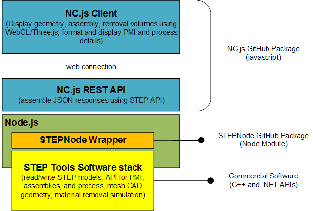

# NC.js Documentation

NC.js is the Web interface for the Digital Thread.  This implements a
rich REST API for process and models as well as a matching client that
displays the 3D part models for machining workpiece, tools, CNC, as
well as removal simulation, PMI annotations, MTConnect positional
data, QIF face status, and other aspects of a Digital Twin on the
Digital Thread.

 - [REST API Description](API.md)
 - [Contents of serialized STEP data](formats.md)
 - [Internal software layout](GettingStarted.md)

## Package Structure

The NC.js package is implemented in Javascript under the Apache
license, so the client and REST API may be customized as desired.  As
the diagram below shows, the server implements the REST API using the
STEPNode module for Node.js.  This module wraps the STEP Tools
commercial technology stack, which is a set of native libraries for
Windows/Linux/Mac that reads and writes STEP and STEP-NC models, does
analysis, geometry manipulation, and material removal simulation.

 - [NC.js Github Package](https://github.com/steptools/NC.js)
 - [STEPNode Github Package](https://github.com/steptools/STEPNode)
 - [STEP Tools Software Stack](https://www.steptools.com/support/)

